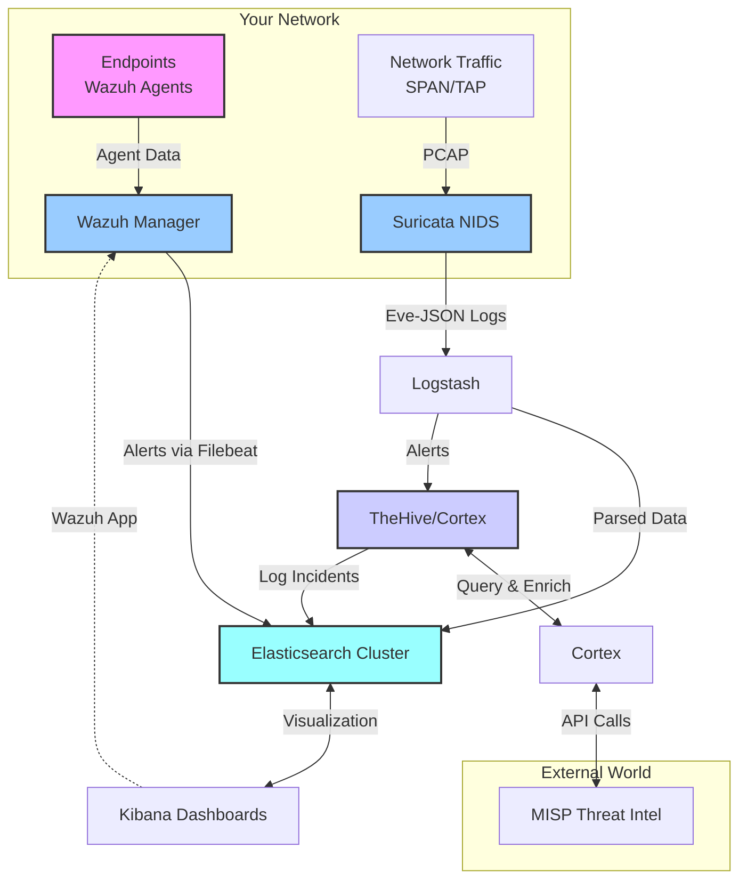

## **Building a DIY Security Operations Center with Open-Source Tools: A Technical Deep Dive**

### **Introduction: Why Roll Your Own SOC?**

Let's cut to the chase: cyber threats aren't going away, and shelling out big bucks for enterprise-grade security suites isn't an option for everyone. That's where the power of open-source comes in. Building a Security Operations Center (SOC) with free tools isn't just a budget-friendly alternative; it's a highly customizable and educational journey that gives you complete visibility and control over your security posture.

This guide is for the sysadmins, the IT pros, and the security enthusiasts who aren't afraid to get their hands dirty with config files and command lines. We'll walk through the core components of a functional SOC, the specific open-source tools that fit each role, and the technical nitty-gritty of making them work together. Remember, a SOC is more than just software; it's a combination of **People, Processes, and Technology**. This article focuses on the technology, but you'll need to build out the alerting, response, and human analysis processes yourself.

---

### **1. The Brain: Security Information and Event Management (SIEM)**

The SIEM is the core of your SOC. It's the central brain that aggregates, normalizes, and correlates logs from every corner of your infrastructure—network devices, servers, endpoints, and applications.

**Tool of Choice: The Elastic Stack (ELK/OpenSearch)**
While all-in-one distros like Security Onion exist, rolling your own with Elasticsearch, Logstash, and Kibana offers maximum flexibility.

*   **Elasticsearch:** This is the distributed search and analytics engine that stores all your log data.
*   **Logstash:** This is the data processing pipeline. It ingests logs from various sources, parses them (using Grok patterns), enriches them, and then ships them to Elasticsearch for storage.
*   **Kibana:** The visualization layer. This is where you build dashboards, run queries, and investigate alerts.

**Technical Configuration Snippet: A Logstash Config for Syslog**
`/etc/logstash/conf.d/syslog.conf`
```bash
input {
  syslog {
    port => 514
    type => "syslog"
  }
}

filter {
  if [type] == "syslog" {
    grok {
      match => { "message" => "%{SYSLOGTIMESTAMP:syslog_timestamp} %{SYSLOGHOST:syslog_hostname} %{DATA:syslog_program}(?:\[%{POSINT:syslog_pid}\])?: %{GREEDYDATA:syslog_message}" }
    }
    date {
      match => [ "syslog_timestamp", "MMM  d HH:mm:ss", "MMM dd HH:mm:ss" ]
    }
  }
}

output {
  elasticsearch {
    hosts => ["http://your-elasticsearch-host:9200"]
    index => "syslog-%{+YYYY.MM.dd}"
  }
}
```
*   This config sets up Logstash to listen for syslog messages on port 514.
*   The `grok` filter is crucial—it uses patterns to parse unstructured syslog data into structured fields like `syslog_hostname` and `syslog_program`.
*   The output directive sends the parsed data to an Elasticsearch index named `syslog-<date>`.

**Data Collection with Beats:** Instead of sending everything through Logstash, use lightweight Beats agents on your endpoints.
*   **Filebeat:** For shipping log files.
*   **Winlogbeat:** For Windows event logs.
*   **Packetbeat:** For network protocol analysis.

---

### **2. The Eyes: Intrusion Detection System (IDS)**

Your SIEM analyzes logs *after* an event. An IDS monitors network traffic *in real-time* to detect malicious activity.

**Tool of Choice: Suricata**
Suricata is a high-performance, open-source Network IDS (NIDS), IPS, and Network Security Monitoring (NSM) engine.

**Technical Configuration Snippet: Suricata Yaml**
`/etc/suricata/suricata.yaml`
```yaml
# Define your home network
vars:
  address-groups:
    HOME_NET: "[192.168.1.0/24,10.200.200.0/24]"
    EXTERNAL_NET: "!$HOME_NET"

# Set the correct network interface
af-packet:
  - interface: enp3s0

# Configure rule paths
default-rule-path: /var/lib/suricata/rules
rule-files:
  - suricata.rules
  - emerging-threats.rules

# Enable Eve JSON log output for Elasticsearch
- eve-log:
    enabled: yes
    filetype: file
    filename: eve.json
    types:
      - alert:
          payload: yes
          payload-buffer-size: 4kb
          payload-printable: yes
      - http:
          extended: yes
      - dns:
          query: yes
          answer: yes
```
*   **Critical:** Accurately define your `HOME_NET` to avoid false positives.
*   Suricata can write logs in JSON format (Eve-log) that Logstash can easily ingest into Elasticsearch, making alert correlation in Kibana seamless.

**Getting Rules:**
1.  **Emerging Threats (ET) Open Ruleset:** A great free starting point: `suricata-update update-sources && suricata-update`.
2.  **Writing Custom Rules:** A simple rule to detect a potential Nmap scan:
    `alert icmp $EXTERNAL_NET any -> $HOME_NET any (msg:"ET SCAN Possible Nmap Scan"; icode:0; itype:8; sid:1000001; rev:1;)`

---

### **3. The Ears: Endpoint Detection and Response (EDR)**

If the IDS watches the network, the EDR watches the hosts. It provides deep visibility into what's happening on your servers and workstations.

**Tool of Choice: Wazuh**
Wazuh is a powerhouse. It's more than an EDR; it combines host-based intrusion detection (HIDS), file integrity monitoring, vulnerability assessment, and log analysis into a single agent.

**How it Works:** Lightweight agents are installed on endpoints. They collect data (logs, file changes, processes) and send it back to a Wazuh manager server. The manager analyzes the data using its decoders and rules and can then forward alerts to your Elasticsearch SIEM.

**Technical Detail: Integrating Wazuh with Elasticsearch**
The Wazuh manager has a built-in `filebeat.yml` configured to ship its alerts to Elasticsearch in a format pre-built for Kibana. After installing the Wazuh server, you simply install the Wazuh Kibana plugin and point it to your Elasticsearch cluster. This gives you a dedicated, sophisticated security UI within Kibana alongside your other data.

**Example Rule: Detecting a File Change in a Sensitive Directory**
Wazuh's `ossec.conf` file can be configured to monitor specific directories:
```xml
<syscheck>
  <frequency>300</frequency>
  <directories check_all="yes" realtime="yes">/etc,/usr/bin,/usr/sbin</directories>
</syscheck>
```
Any change to files in these directories will trigger a alert, which is sent to your SIEM dashboard.

---

### **4. The External Intel: Threat Intelligence Platform (TIP)**

You can't just look inward. A SOC needs context from the outside world to know what to look for. A TIP integrates external data on known malicious IPs, domains, and file hashes.

**Tool of Choice: MISP (Malware Information Sharing Platform)**
MISP is the standard for sharing structured threat intelligence.

**Technical Integration:** Both Wazuh and TheHive can be integrated with MISP. This allows you to:
*   Automatically enrich alerts in your SIEM with threat intel from MISP (e.g., "This alert triggered on an IP that MISP lists as a known C2 server!").
*   Export indicators from your investigations back to MISP to share with the community.

---

### **5. The Muscle: Security Orchestration, Automation, and Response (SOAR)**

When an alert is confirmed as an incident, you need a playbook. A SOAR platform helps manage the incident response lifecycle from start to finish.

**Tool of Choice: TheHive + Cortex**
*   **TheHive:** A fantastic open-source incident response platform. It's where you create a "case" for each security incident, gather evidence (alerts, logs, malware files), and assign tasks to analysts.
*   **Cortex:** TheHive's automation muscle. It allows you to run "analyzers" on data within a case. For example, you can right-click a suspicious file hash in TheHive and have Cortex automatically query VirusTotal, Hybrid-Analysis, and other services using their APIs, then bring the results back into the case.

**Technical Setup:** The easiest way to run this stack is with **Docker**. A `docker-compose.yml` file can spin up TheHive, Cortex, and a supporting database (Cassandra/Elasticsearch) in minutes.

---

### **Putting It All Together: Architecture & Data Flow**

Here’s how these components interact in a typical DIY SOC architecture:



**Data Flow:**
1.  **Collection:** Agents (Wazuh, Beats) and sensors (Suricata) collect raw data from endpoints and network traffic.
2.  **Processing & Analysis:** Logs are parsed by Logstash. Wazuh and Suricata analyze their data streams using rules to generate security alerts.
3.  **Storage & Correlation:** All data (logs and alerts) are stored in Elasticsearch.
4.  **Visualization & Investigation:** Analysts use Kibana dashboards to view correlated data and investigate alerts.
5.  **Response:** Confirmed incidents are escalated to TheHive for case management and automated investigation via Cortex, which can pull in context from MISP.

---

### **Disclaimer & Final Words**

**⚠️ Important Disclaimer:** This is a simplified overview. Building a real SOC is a significant undertaking.
*   **It's Not "Free":** While the software is free, it requires substantial hardware resources (RAM, CPU, fast storage) and, most importantly, a major investment of **time and expertise** to configure, tune, and maintain.
*   **No Silver Bullet:** This stack won't make you secure by itself. Its effectiveness is 100% dependent on the quality of your rule tuning, log sources, and the analysts interpreting the data.
*   **Lab First:** **DO NOT** deploy this straight into a production environment. Test everything extensively in a lab. Simulate attacks with tools like Kali Linux to validate your detection capabilities.

This open-source stack—**Elasticsearch + Wazuh + Suricata + TheHive/Cortex + MISP**—provides a formidable foundation for a SOC that rivals commercial offerings in capability, if not in out-of-the-box polish. The deep customization and hands-on knowledge you gain are invaluable. Now, go forth, configure, and detect!
